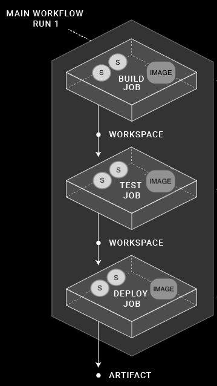

# CircleCI
## 安装
- Mac & Linux
```sh
curl -fLSs https://circle.ci/cli | bash
```
CircleCI默认安装到`/usr/local/bin`目录下，如果要指定安装的目录，需要指定`DESTDIR`参数
```sh
curl -fLSs https://circle.ci/cli | DESTDIR=/opt/bin bash
```
- 手动下载CircleCI

[GitHub](https://github.com/CircleCI-Public/circleci-cli/releases)
- 更新CircleCI
```sh
circleci update
circleci switch
```
## 配置
使用CircleCI之前，需要从[Personal Api Token](https://circleci.com/account/api)生成一个CircleCI API Token,获得Token之后，执行`circleci setup`开始配置；如果是在circle.com上使用，就保持默认的CircleCI host，如果是在私有云上使用，则要更换为你安装的服务其地址
- 验证CircleCI配置

可以不用每次提交代码去测试config.yml，而是通过本地验证的方式验证配置;首先，切换到 `.circleci/config.yml`所在目录，执行
```sh
# 验证配置文件
circleci config validate
# 执行本地build
circleci local execute
```
> 可以通过在命令末尾加上`--help`获取命令的邦族信息，如`circle local execute --help`
如果和[Orbs](https://circleci.com/orbs/)一起使用的话，可以执行
```sh
circleci orb validate /tmp/my_orb.yml
```
- Packing A Config

CLI提供 `pack` 命令，允许你使用多个碎片文件合成单个yaml配置文件
```sh
circleci config pack
```
- 例子
    + 文件树
    ```
    $ tree
    .
    └── your-orb-source
        ├── @orb.yml
        ├── commands
        │   └── foo.yml
        └── jobs
            └── bar.yml
    ```
    + 打包命令
    ```sh
    circleci config pack your-orb-source
    ```
    + 打包结果
    ```
    # contents of @orb.yml appear here
    commands:
        foo:
            # contents of foo.yml appear here
    jobs:
        bar:
            # contents of bar.yml appear here
    ```
- Processing A Config

## 缓存
- 使用
```yml
version: 2
jobs:
  build1:
    docker: # Each job requires specifying an executor
    # (either docker, macos, or machine), see
    # circleci.com/docs/2.0/executor-types/ for a comparison
    # and more examples.
      - image: circleci/ruby:2.4-node
      - image: circleci/postgres:9.4.12-alpine
    steps:
      - checkout
      - save_cache: # Caches dependencies with a cache key
      # template for an environment variable,
      # see circleci.com/docs/2.0/caching/
          key: v1-repo-{{ .Environment.CIRCLE_SHA1 }}
          paths:
            - ~/circleci-demo-workflows

  build2:
    docker:
      - image: circleci/ruby:2.4-node
      - image: circleci/postgres:9.4.12-alpine
    steps:
      - restore_cache: # Restores the cached dependency.
          key: v1-repo-{{ .Environment.CIRCLE_SHA1 }}
```

## Workflows
定义了jobs list的执行顺序，可以让jobs以 parallel, sequentially, on a schedule, or with a manual gate using an approval job的方式运行
- 例子
```yml
version: 2
jobs:
  build1:
    docker:
      - image: circleci/ruby:2.4-node
      - image: circleci/postgres:9.4.12-alpine
    steps:
      - checkout
      - save_cache: # Caches dependencies with a cache key
          key: v1-repo-{{ .Environment.CIRCLE_SHA1 }}
          paths:
            - ~/circleci-demo-workflows
      
  build2:
    docker:
      - image: circleci/ruby:2.4-node
      - image: circleci/postgres:9.4.12-alpine
    steps:
      - restore_cache: # Restores the cached dependency.
          key: v1-repo-{{ .Environment.CIRCLE_SHA1 }}
      - run:
          name: Running tests
          command: make test
  build3:
    docker:
      - image: circleci/ruby:2.4-node
      - image: circleci/postgres:9.4.12-alpine
    steps:
      - restore_cache: # Restores the cached dependency.
          key: v1-repo-{{ .Environment.CIRCLE_SHA1 }}
      - run:
          name: Precompile assets
          command: bundle exec rake assets:precompile
#...                          
workflows:
  version: 2
  build_and_test: # name of your workflow
    jobs:
      - build1
      - build2:
          requires:
           - build1 # wait for build1 job to complete successfully before starting
           # see circleci.com/docs/2.0/workflows/ for more examples.
      - build3:
          requires:
           - build1 # wait for build1 job to complete successfully before starting
           # run build2 and build3 in parallel to save time.
```
- Workspce & Artifact
流程如下，Workspce可以在jobs运行时传递数据，就像一个是spring的应用上下文，Artifact是运行完后持久化保存build数据

- 例子
```yml
version: 2
jobs:
  build1:
#...   
    steps:    
      - persist_to_workspace: # Persist the specified paths (workspace/echo-output)
      # into the workspace  for use in downstream job. Must be an absolute path,
      # or relative path from working_directory. This is a directory on the container which is
      # taken to be the root directory of the workspace.
          root: workspace
            # Must be relative path from root
          paths:
            - echo-output

  build2:
#...
    steps:
      - attach_workspace:
        # Must be absolute path or relative path from working_directory
          at: /tmp/workspace
  build3:
#...
    steps:
      - store_artifacts: # See circleci.com/docs/2.0/artifacts/ for more details.
          path: /tmp/artifact-1
          destination: artifact-file
#...
```
- Artifacts、Workspace、Caches的区别

| Type | Lifetime | Use | Example |
| :- | :- | :- | :- |
| Artifacts | Months | Preserve long-term artifacts. | Available in the Artifacts tab of the Job page under the `tmp/circle-artifacts.<hash>/container` or similar directory. |
| Workspaces | Duration of workflow | Attach the workspace in a downstream container with the attach_workspace: step. | The attach_workspace copies and re-creates the entire workspace content when it runs. |
| Caches | Months | Store non-vital data that may help the job run faster, for example npm or Gem packages | The save_cache job step with a path to a list of directories to add and a key to uniquely identify the cache (for example, the branch, build number, or revision). Restore the cache with restore_cache and the appropriate key |

## Orbs,Jobs,Steps,Workflows
